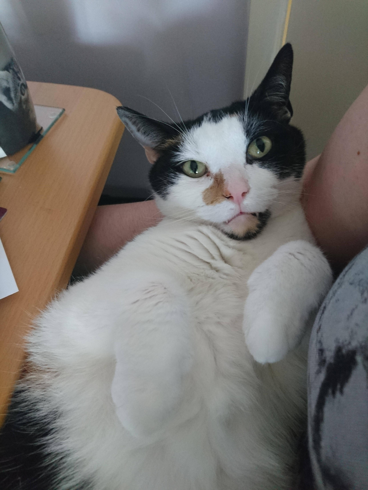
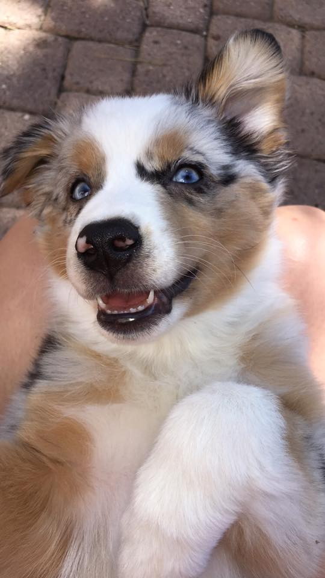
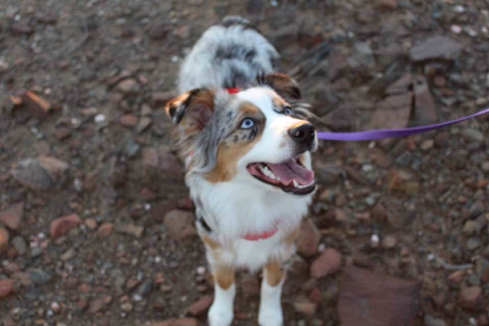
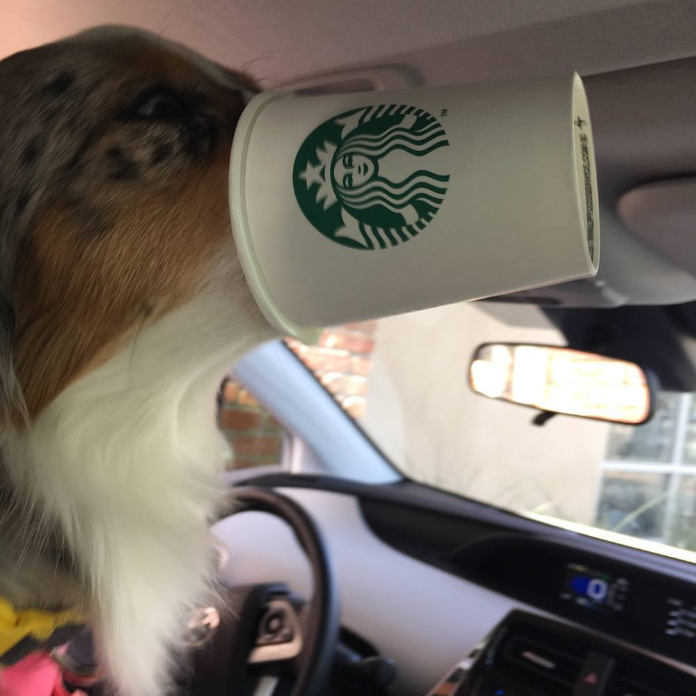
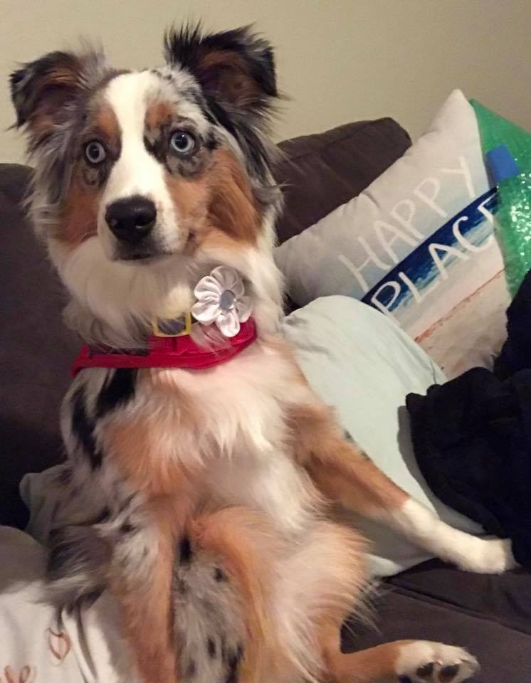
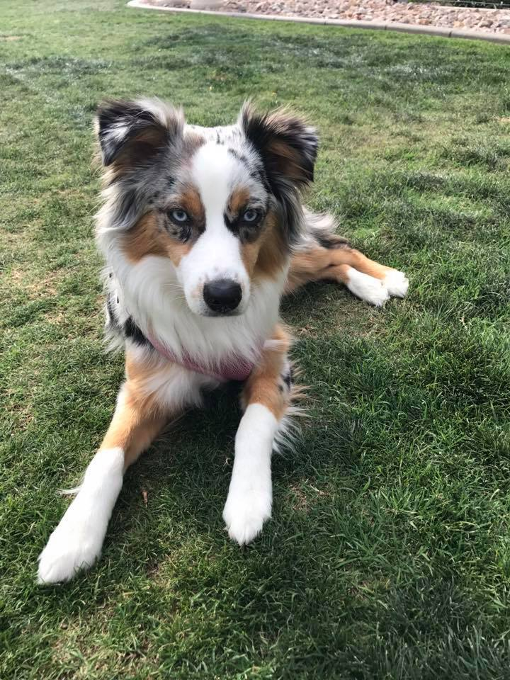
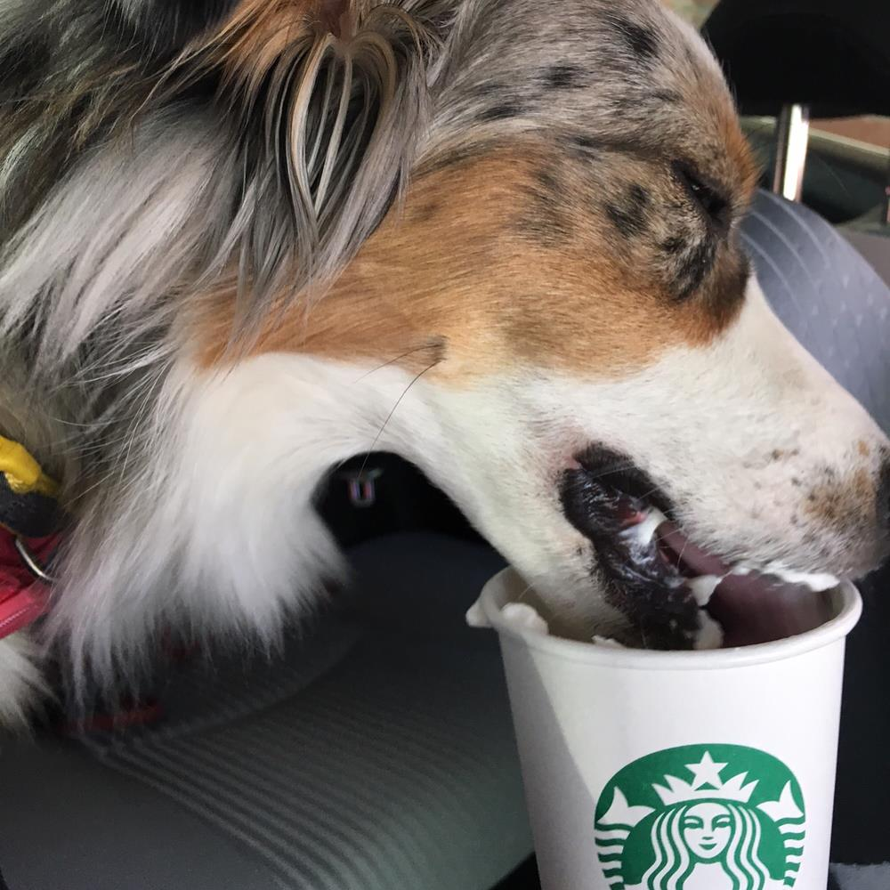
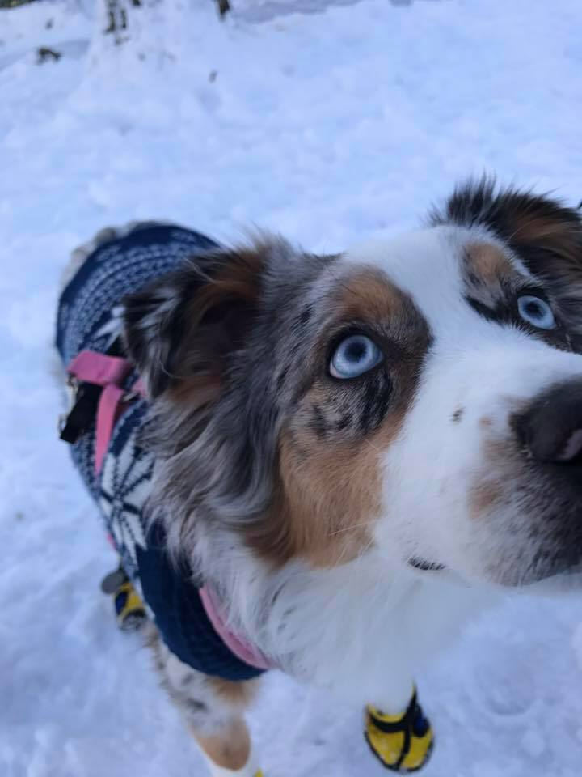
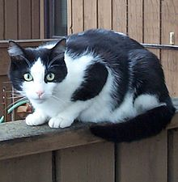

# dog-or-cat
Distinguishing between images of dogs and cats using a convolutional neural network. This model achieves 87% accuracy on the validation set.

Here are a few examples with my friend's dog Tesla and a couple random images of cats:

Dog with probability 0.99901474

Dog with probability 0.24755888 (0.75 cat)

Dog with probability 0.99901962

Dog with probability 0.99995852

Dog with probability 0.00600681 (incorrect)

Dog with probability 0.97458273

Dog with probability 1.0

Dog with probability 0.45387861 (incorrect)

Dog with probability 0.91537327

Dog with probability 0.05840412
